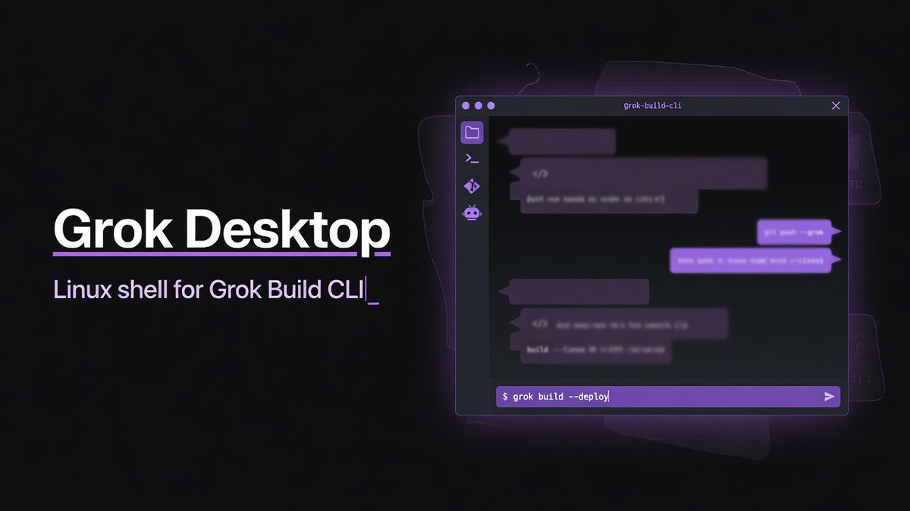
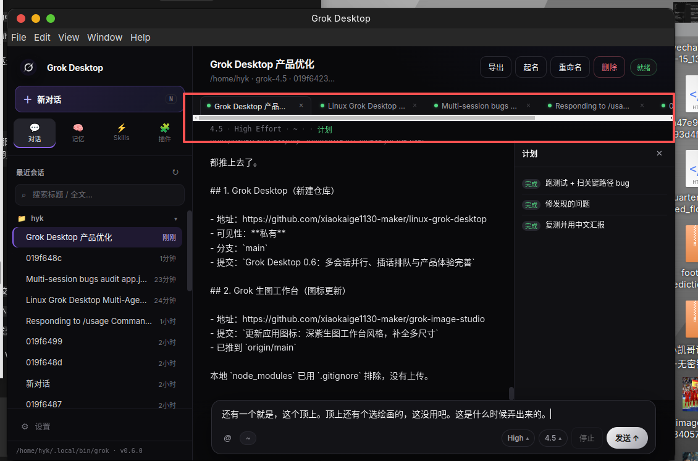
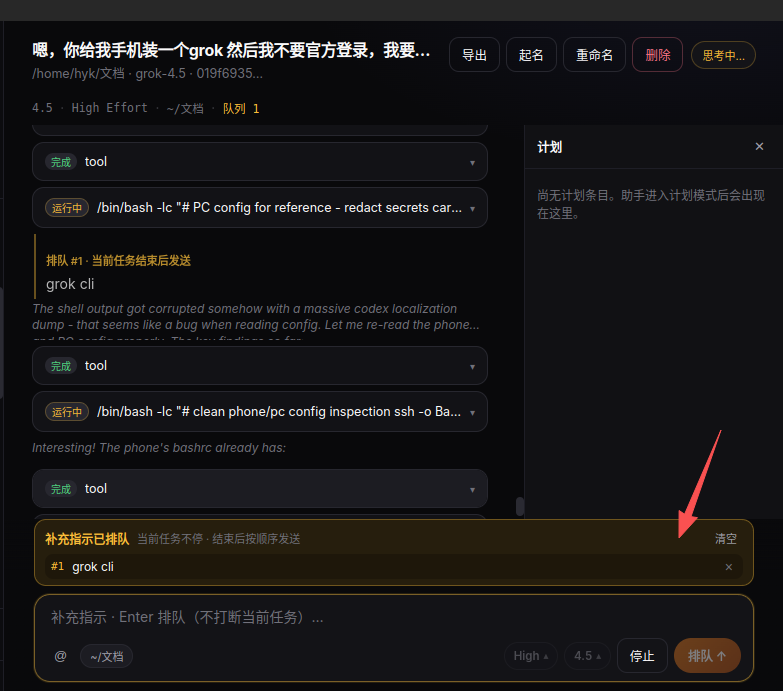
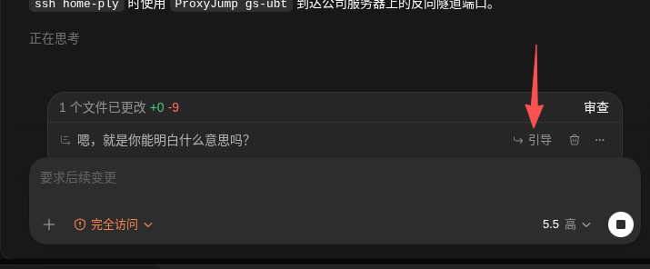
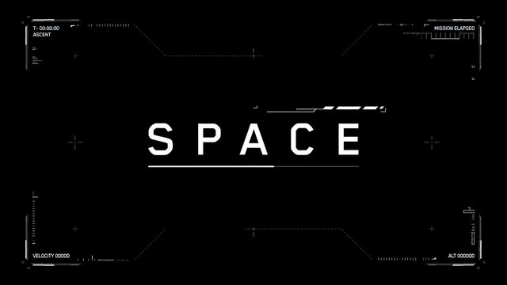

# Grok Desktop

<p align="center">
  
</p>

<p align="center">
  <strong>A focused desktop workspace for the official Grok CLI</strong><br />
  <strong>基于官方 Grok CLI 的跨平台桌面工作区</strong>
</p>

<p align="center">
  Windows 11 / 10 · Linux · Multi-session · Plan panel · Diff viewer · MCP · Skills · 中文 / English
</p>

<p align="center">
  <a href="https://github.com/xiaokaige1130-maker/linux-grok-desktop/releases/latest">
    
  </a>
  <a href="https://github.com/xiaokaige1130-maker/linux-grok-desktop/releases/latest">
    
  </a>
</p>

<p align="center">
  
  
  
  
</p>

<p align="center">
  <a href="#中文">中文</a> ·
  <a href="#english">English</a> ·
  <a href="https://github.com/xiaokaige1130-maker/linux-grok-desktop/releases">全部版本 / Releases</a> ·
  <a href="https://github.com/xiaokaige1130-maker/linux-grok-desktop/issues">问题反馈 / Issues</a>
</p>



> [!IMPORTANT]
> Grok Desktop 是社区项目，不是 xAI 官方产品。它不内置账号或模型服务，而是连接你电脑上已经安装并登录的官方 `grok` CLI。<br />
> Grok Desktop is a community project, not an official xAI product. It uses the official `grok` CLI installed and authenticated on your computer.

---

<a id="中文"></a>

## 中文

### 一眼看懂

Grok Desktop 把 Grok CLI 的 Agent 能力放进一个适合长期工作的独立窗口。你可以同时运行多个会话，查看文件修改、管理计划、切换模型和权限模式，并继续使用 CLI 已有的 MCP、插件、Skills 与记忆。

它不是网页聊天套壳，也不会替换官方 CLI：

- **Agent 后端**：官方 `grok agent`，通过 ACP 通信。
- **账号与额度**：继续由官方 Grok CLI 和你的 xAI 账号管理。
- **会话与配置**：保存在本机，不需要把 CLI 登录信息交给桌面应用。
- **支持平台**：Windows x64 与 Linux x64。

### 界面预览



<table>
  <tr>
    <td width="50%">
      <strong>多会话工作区</strong><br />
      项目分组、运行状态、历史搜索和后台完成提示集中在左侧。
    </td>
    <td width="50%">
      <strong>计划与上下文</strong><br />
      在同一窗口查看计划进度、工具调用、文件差异和 Agent 输出。
    </td>
  </tr>
  <tr>
    <td colspan="2">
      
    </td>
  </tr>
</table>

### 核心功能

| 功能 | 能做什么 |
|---|---|
| **多会话并行** | 同时运行多个 Agent 会话；切换页面不会终止后台任务；侧栏显示运行中与已完成状态。 |
| **会话管理** | 新建、恢复、重命名、导出和删除会话；按工作目录分组；搜索标题与历史内容。 |
| **排队与引导** | Agent 工作时按 Enter 将消息排队；点击“引导”可打断当前步骤并立即发送修正。 |
| **计划面板** | 顶栏随时打开计划；显示待办数量、完成进度和当前步骤；支持 `P` 快捷键。 |
| **文件 Diff** | 工具修改文件时显示行级差异，便于检查新增、删除和替换内容。 |
| **模型与思考强度** | 从 CLI 返回的可用模型中选择，并调整适合当前任务的思考强度。 |
| **权限模式** | 审批、智能、完全访问三种模式；在效率和风险控制之间快速切换。 |
| **MCP / 插件 / Skills** | 读取并管理官方 CLI 已有能力，不建立另一套相互冲突的配置。 |
| **记忆** | 查看记忆状态和内容，并通过 CLI 执行清理等操作。 |
| **中英界面** | 在设置中切换中文与 English，无需重装。 |
| **桌面体验** | 后台任务完成通知、首次启动诊断、更新检查、快捷键帮助与自定义聊天背景。 |

### 排队与“引导”

当 Agent 正在工作时，新消息默认不会粗暴打断当前操作：

1. 输入补充要求并按 **Enter**，消息进入队列。
2. 队列中的内容可以继续编辑或删除。
3. 需要立即改变方向时，点击气泡上的 **引导**，当前运行会被中断并发送该消息。



### 权限模式

| 模式 | 行为 | 建议场景 |
|---|---|---|
| **审批模式** | 写文件或运行命令前请求确认。 | 陌生仓库、审查任务、高风险环境。 |
| **智能模式** | 常规操作自动执行，高风险操作继续询问。 | 日常开发，推荐默认使用。 |
| **完全访问** | 默认批准工具操作，可进一步启用更激进的自动执行。 | 完全可信的本机项目。 |

权限可以在 **设置 → 权限** 中随时修改。权限越高，自动执行范围越大；在不了解项目内容时不要直接使用完全访问。

### 个性化背景

在 **设置 → 外观** 中选择渐变、航天主题、自定义图片和背景压暗程度。

| X | Rocket | Orbit | SPACE | Stack |
|:---:|:---:|:---:|:---:|:---:|
|  |  |  |  |  |

### 安装前准备

必须先安装并登录官方 Grok CLI：

```powershell
grok --version
grok login
```

如果 `grok --version` 无法执行，请先按照 [x.ai/cli](https://x.ai/cli) 的官方说明安装 CLI。Grok Desktop 不包含 Grok CLI，也不会绕过官方登录。

### Windows 安装

从 [最新 Release](https://github.com/xiaokaige1130-maker/linux-grok-desktop/releases/latest) 下载以下任一文件：

| 文件 | 适合谁 |
|---|---|
| `Grok-Desktop-0.8.0-Windows-Setup-x64.exe` | 推荐。安装到系统，创建开始菜单与桌面快捷方式。 |
| `Grok-Desktop-0.8.0-Windows-Portable-x64.exe` | 免安装。适合临时使用或放在自定义目录。 |

首次运行：

1. 在 PowerShell 确认 `grok --version` 正常。
2. 执行 `grok login` 并完成登录。
3. 运行安装版或 portable 版。
4. 在首次引导中检查 CLI 与登录状态。
5. 点击 **新对话**，选择工作目录。

> [!NOTE]
> 当前安装包未使用商业代码签名证书。Windows SmartScreen 可能显示“未知发布者”，请确认文件来自本仓库 Release 后再继续。

#### Windows 找不到 Grok CLI

应用会自动查找常见位置，包括 `%USERPROFILE%\.grok\bin\grok.exe`。如果 CLI 安装在其他目录，可以在 PowerShell 指定完整路径：

```powershell
setx GROK_CLI "C:\完整路径\grok.exe"
```

设置后完全退出并重新打开 Grok Desktop。

### Linux 安装

从 [最新 Release](https://github.com/xiaokaige1130-maker/linux-grok-desktop/releases/latest) 下载 `.deb`。

Debian / Ubuntu：

```bash
sudo dpkg -i linux-grok-desktop_0.8.0_amd64.deb
sudo apt-get install -f
```

应用会优先查找 `~/.local/bin/grok`，也支持 `/usr/local/bin/grok`、`/usr/bin/grok` 和 `PATH` 中的 `grok`。自定义路径可通过 `GROK_CLI` 环境变量设置。

### 快速使用

1. 点击 **新对话**并选择项目目录。
2. 在输入区描述任务，选择模型和思考强度。
3. 在会话运行时切换到其他会话，后台任务会继续。
4. 打开 **计划**查看步骤，展开工具卡片检查命令和 Diff。
5. 需要补充要求时先排队；需要立刻改变方向时使用 **引导**。
6. 完成后可重命名、导出或删除会话。

### 数据与隐私

- Grok CLI 登录、会话、模型和额度由官方 CLI 管理。
- 桌面设置只保存在本机用户配置目录。
- 应用不会要求你把 xAI 密码或令牌粘贴到界面中。
- MCP、插件、Skills 和工具调用拥有你授予的本机权限，请只在可信环境中使用高权限模式。

### 常见问题

<details>
<summary><strong>提示“创建失败”或“请先登录官方 Grok CLI”</strong></summary>

先在同一 Windows 用户的 PowerShell 中运行：

```powershell
grok --version
grok login
```

如果 PowerShell 正常但桌面应用仍找不到 CLI，请设置 `GROK_CLI` 为 `grok.exe` 的完整路径并重启应用。
</details>

<details>
<summary><strong>为什么按 Enter 没有立即改变 Agent 的方向？</strong></summary>

Agent 运行时，Enter 的设计是“排队”。点击排队气泡上的“引导”才会中断当前步骤并立即发送。
</details>

<details>
<summary><strong>为什么没有计划内容？</strong></summary>

计划按钮始终可打开，但只有 Agent 创建或更新计划后才会显示条目。简单任务可能不需要计划。
</details>

<details>
<summary><strong>桌面版会影响终端里的 Grok CLI 吗？</strong></summary>

不会替换 CLI。两者共享官方 CLI 的账号和会话数据，因此同一份登录状态可以继续使用。
</details>

---

<a id="english"></a>

## English

### Overview

Grok Desktop turns the official Grok CLI agent into a focused, long-running desktop workspace. Run several sessions in parallel, inspect file changes, follow plans, choose models and permission modes, and keep using your existing MCP servers, plugins, Skills, and memory.

This is not a browser chat wrapper and it does not replace the official CLI:

- **Agent backend:** official `grok agent`, connected through ACP.
- **Account and quota:** managed by the official Grok CLI and your xAI account.
- **Local state:** sessions and desktop preferences remain on your computer.
- **Platforms:** Windows x64 and Linux x64.

### Interface


The sidebar organizes sessions by workspace and reports background activity. The main area combines the conversation, tool calls, diffs, queued guidance, model controls, and an optional plan panel.


### Feature Guide

| Feature | Details |
|---|---|
| **Parallel sessions** | Keep multiple agents running at once. Switching views does not stop background work, and the sidebar shows running and completed states. |
| **Session management** | Create, resume, rename, export, and delete sessions. Group them by workspace and search titles or history. |
| **Queue and Guide** | Press Enter to queue a message while the agent is busy. Use Guide to interrupt the current step and send a correction immediately. |
| **Plan panel** | Open the plan from the top bar, review pending and completed steps, and use the `P` shortcut. |
| **File diffs** | Inspect line-level changes produced by tools without leaving the conversation. |
| **Models and effort** | Select from models exposed by your CLI and choose an appropriate reasoning effort. |
| **Access modes** | Switch among Approval, Smart, and Full access based on the trust level of the project. |
| **MCP / plugins / Skills** | Work with the CLI configuration you already use instead of maintaining a second isolated setup. |
| **Memory** | Inspect memory state and invoke CLI-backed memory operations. |
| **Bilingual UI** | Switch between Chinese and English from Settings without reinstalling. |
| **Desktop polish** | Background completion notifications, first-run diagnostics, update checks, shortcut help, and customizable chat backgrounds. |

### Queue and Guide

When an agent is already working:

1. Type a follow-up and press **Enter** to place it in the queue.
2. Edit or remove queued messages before they are sent.
3. Click **Guide** on a queued message to interrupt the current step and send it now.


### Access Modes

| Mode | Behavior | Recommended use |
|---|---|---|
| **Approval** | Requests confirmation before file writes and commands. | Unknown repositories and review work. |
| **Smart** | Runs routine actions automatically and still asks for risky operations. | Recommended for everyday development. |
| **Full access** | Approves tools by default, with an optional more aggressive automation setting. | Fully trusted local projects only. |

Change the mode at any time under **Settings → Permissions**.

### Prerequisite: Official Grok CLI

Install and authenticate the official Grok CLI before launching the desktop app:

```text
grok --version
grok login
```

Follow the official instructions at [x.ai/cli](https://x.ai/cli) if the first command is unavailable. Grok Desktop does not bundle the CLI or bypass official authentication.

### Install on Windows

Download one of these files from the [latest Release](https://github.com/xiaokaige1130-maker/linux-grok-desktop/releases/latest):

| Package | Use |
|---|---|
| `Grok-Desktop-0.8.0-Windows-Setup-x64.exe` | Recommended installer with Start menu and desktop shortcuts. |
| `Grok-Desktop-0.8.0-Windows-Portable-x64.exe` | Standalone executable that does not require installation. |

Before the first launch, open PowerShell and verify:

```powershell
grok --version
grok login
```

The app automatically checks common locations such as `%USERPROFILE%\.grok\bin\grok.exe`. For a custom installation, set the full path and restart the app:

```powershell
setx GROK_CLI "C:\full\path\to\grok.exe"
```

> [!NOTE]
> The Windows packages are currently unsigned. SmartScreen may display an unknown publisher warning. Verify that the file came from this repository's Release page before continuing.

### Install on Linux

Debian / Ubuntu:

```bash
sudo dpkg -i linux-grok-desktop_0.8.0_amd64.deb
sudo apt-get install -f
```

The app checks `~/.local/bin/grok`, `/usr/local/bin/grok`, `/usr/bin/grok`, and `PATH`. Set `GROK_CLI` when using a custom location.

### Run From Source

Requirements: Node.js 18+, npm, and an authenticated official Grok CLI.

```bash
git clone https://github.com/xiaokaige1130-maker/linux-grok-desktop.git
cd linux-grok-desktop
npm install
npm start
```

Build packages:

```bash
npm run dist:win       # NSIS installer + portable executable, run on Windows
npm run dist:deb       # Debian package, run on Linux
npm run dist:appimage  # AppImage, run on Linux
```

### How It Works

```text
Grok Desktop
  ├─ Electron main process: session pool, IPC, notifications, update checks
  ├─ Renderer: conversations, plans, diffs, settings, search
  ├─ ACP client: structured communication with the agent
  └─ Official Grok CLI: authentication, models, sessions, tools, MCP
```

The desktop app is an interface and orchestration layer. The official CLI remains the source of truth for authentication, model access, and agent execution.

### Privacy and Security

- Authentication and account state stay with the official Grok CLI.
- Desktop preferences are stored in the current user's local configuration directory.
- The app does not ask you to paste xAI passwords or tokens into its UI.
- Tools, MCP servers, plugins, and Skills can access your computer according to the permission mode you select.

### Troubleshooting

<details>
<summary><strong>Session creation fails or the CLI cannot be found</strong></summary>

Run `grok --version` and `grok login` as the same operating-system user. If they work in PowerShell but not in the app, set `GROK_CLI` to the full executable path and restart Grok Desktop.
</details>

<details>
<summary><strong>Enter did not interrupt the agent</strong></summary>

Enter queues the message by design. Click Guide on the queued bubble to interrupt and send immediately.
</details>

<details>
<summary><strong>The plan panel is empty</strong></summary>

The panel becomes populated after the agent creates or updates a plan. Small tasks may complete without one.
</details>

### Contributing

Bug reports and focused pull requests are welcome through [GitHub Issues](https://github.com/xiaokaige1130-maker/linux-grok-desktop/issues). Include your operating system, Grok CLI version, reproduction steps, and relevant error text.

### Project Notice

- Community-maintained and independent from xAI.
- Grok, xAI, and related names belong to their respective owners.
- Bundled visual presets are original stylistic assets, not official brand artwork.

---

<p align="center">
  <strong>Grok Desktop 0.8.0</strong><br />
  Windows and Linux, powered by the official Grok CLI.
</p>
